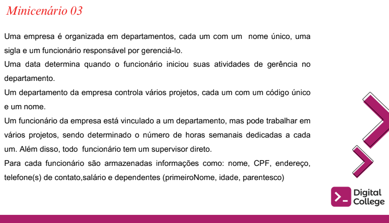
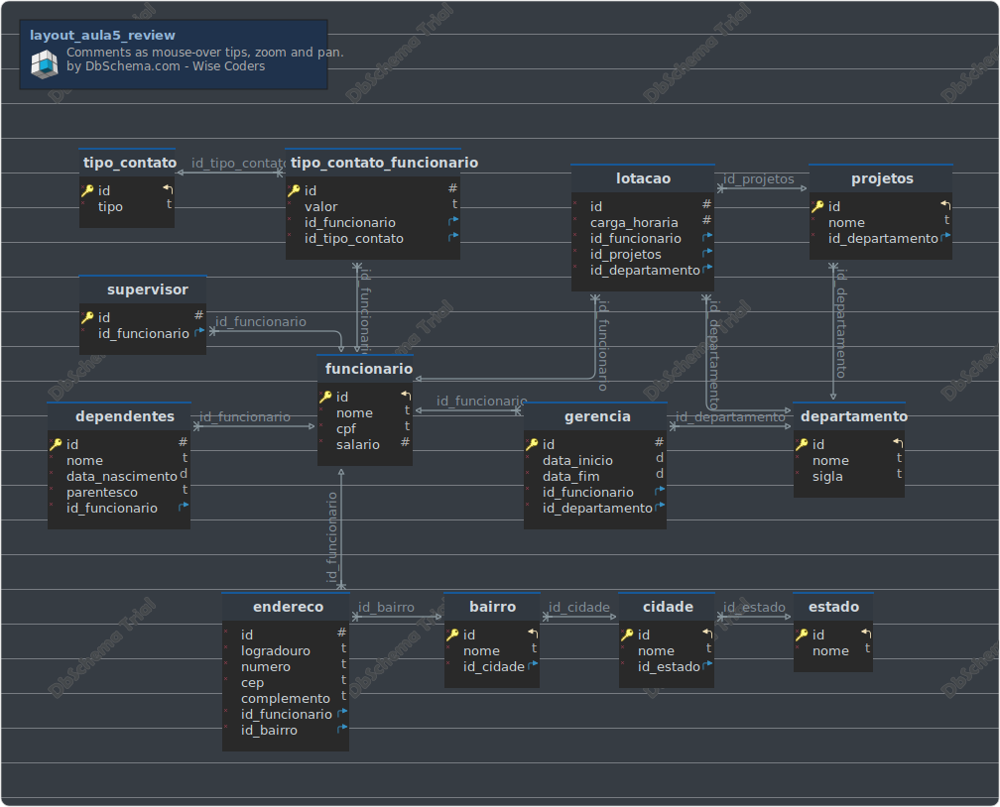

# Projeto de Modelagem de Banco de Dados - DbSchema

Desenvolvimento de Novo Projeto de Modelagem de Banco de Dados com DbSchema (Ferramenta de design e gerenciamento de banco de dados visual). `Aula 05, Exercício 1 (Review), Módulo 01 (SQL).`

Instituição: [Digital College Brasil](https://digitalcollege.com.br/) (Fortaleza/CE)  
Curso: Data Analytics (Turma 18)  
Instrutora: [NayaraWakweski](https://github.com/NayaraWakewski)  

 

### Project Statement

#layout_aula5_review
Generated using [DbSchema](https://dbschema.com)

### layout_aula5_review

### Table aula5_review.bairro 
|Idx |Name |Data Type |
|---|---|---|
| * &#128273;  &#11019; | id| INTEGER UNSIGNED  |
| * | nome| VARCHAR(100)  |
| * &#11016; | id\_cidade| INTEGER UNSIGNED  |

##### Indexes 
|Type |Name |On |
|---|---|---|
| &#128273;  | pk\_bairro | ON id|

##### Foreign Keys
|Type |Name |On |
|---|---|---|
|  | fk_bairro_cidade | ( id\_cidade ) ref [aula5\_review.cidade](#cidade) (id) |

### Table aula5_review.cidade 
|Idx |Name |Data Type |
|---|---|---|
| * &#128273;  &#11019; | id| INTEGER UNSIGNED  |
| * | nome| VARCHAR(100)  |
| * &#11016; | id\_estado| INTEGER UNSIGNED  |

##### Indexes 
|Type |Name |On |
|---|---|---|
| &#128273;  | pk\_cidade | ON id|

##### Foreign Keys
|Type |Name |On |
|---|---|---|
|  | fk_cidade_estado | ( id\_estado ) ref [aula5\_review.estado](#estado) (id) |

### Table aula5_review.departamento 
|Idx |Name |Data Type |
|---|---|---|
| * &#128273;  &#11019; | id| INTEGER UNSIGNED  |
| * | nome| VARCHAR(100)  |
| * | sigla| VARCHAR(20)  |

##### Indexes 
|Type |Name |On |
|---|---|---|
| &#128273;  | pk\_departamento | ON id|

### Table aula5_review.dependentes 
|Idx |Name |Data Type |
|---|---|---|
| * &#128273;  | id| INTEGER UNSIGNED  |
| * | nome| VARCHAR(100)  |
| * | data\_nascimento| DATE  |
| * | parentesco| VARCHAR(50)  |
| * &#11016; | id\_funcionario| INTEGER UNSIGNED  |

##### Indexes 
|Type |Name |On |
|---|---|---|
| &#128273;  | pk\_dependentes | ON id|

##### Foreign Keys
|Type |Name |On |
|---|---|---|
|  | fk_dependentes_funcionario | ( id\_funcionario ) ref [aula5\_review.funcionario](#funcionario) (id) |

### Table aula5_review.endereco 
|Idx |Name |Data Type |
|---|---|---|
| * | id| INTEGER UNSIGNED  |
| * | logradouro| VARCHAR(100)  |
| * | numero| VARCHAR(10)  |
| * | cep| VARCHAR(20)  |
|  | complemento| VARCHAR(100)  |
| * &#11016; | id\_funcionario| INTEGER UNSIGNED  |
| * &#11016; | id\_bairro| INTEGER UNSIGNED  |

##### Foreign Keys
|Type |Name |On |
|---|---|---|
|  | fk_endereco_funcionario | ( id\_funcionario ) ref [aula5\_review.funcionario](#funcionario) (id) |
|  | fk_endereco_bairro | ( id\_bairro ) ref [aula5\_review.bairro](#bairro) (id) |

### Table aula5_review.estado 
|Idx |Name |Data Type |
|---|---|---|
| * &#128273;  &#11019; | id| INTEGER UNSIGNED  |
| * | nome| VARCHAR(100)  |

##### Indexes 
|Type |Name |On |
|---|---|---|
| &#128273;  | pk\_estado | ON id|

### Table aula5_review.funcionario 
|Idx |Name |Data Type |
|---|---|---|
| * &#128273;  &#11019; | id| INTEGER UNSIGNED  |
| * | nome| VARCHAR(100)  |
| * | cpf| VARCHAR(20)  |
| * | salario| NUMERIC(8,2) UNSIGNED  |

##### Indexes 
|Type |Name |On |
|---|---|---|
| &#128273;  | pk\_funcionario | ON id|

### Table aula5_review.gerencia 
|Idx |Name |Data Type |
|---|---|---|
| * &#128273;  | id| INTEGER UNSIGNED  |
| * | data\_inicio| DATE  |
| * | data\_fim| DATE  |
| * &#11016; | id\_funcionario| INTEGER UNSIGNED  |
| * &#11016; | id\_departamento| INTEGER UNSIGNED  |

##### Indexes 
|Type |Name |On |
|---|---|---|
| &#128273;  | pk\_gerencia | ON id|

##### Foreign Keys
|Type |Name |On |
|---|---|---|
|  | fk_gerencia_funcionario | ( id\_funcionario ) ref [aula5\_review.funcionario](#funcionario) (id) |
|  | fk_gerencia_departamento | ( id\_departamento ) ref [aula5\_review.departamento](#departamento) (id) |

### Table aula5_review.lotacao 
|Idx |Name |Data Type |
|---|---|---|
| * | id| INTEGER UNSIGNED  |
| * | carga\_horaria| NUMERIC(8,8) UNSIGNED  |
| * &#11016; | id\_funcionario| INTEGER UNSIGNED  |
| * &#11016; | id\_projetos| INTEGER UNSIGNED  |
| * &#11016; | id\_departamento| INTEGER UNSIGNED  |

##### Foreign Keys
|Type |Name |On |
|---|---|---|
|  | fk_lotacao_funcionario | ( id\_funcionario ) ref [aula5\_review.funcionario](#funcionario) (id) |
|  | fk_lotacao_projetos | ( id\_projetos ) ref [aula5\_review.projetos](#projetos) (id) |
|  | fk_lotacao_departamento | ( id\_departamento ) ref [aula5\_review.departamento](#departamento) (id) |

### Table aula5_review.projetos 
|Idx |Name |Data Type |
|---|---|---|
| * &#128273;  &#11019; | id| INTEGER UNSIGNED  |
| * | nome| VARCHAR(100)  |
| * &#11016; | id\_departamento| INTEGER UNSIGNED  |

##### Indexes 
|Type |Name |On |
|---|---|---|
| &#128273;  | pk\_projetos | ON id|

##### Foreign Keys
|Type |Name |On |
|---|---|---|
|  | fk_projetos_departamento | ( id\_departamento ) ref [aula5\_review.departamento](#departamento) (id) |

### Table aula5_review.supervisor 
|Idx |Name |Data Type |
|---|---|---|
| * &#128273;  | id| INTEGER UNSIGNED  |
| * &#11016; | id\_funcionario| INTEGER UNSIGNED  |

##### Indexes 
|Type |Name |On |
|---|---|---|
| &#128273;  | pk\_supervisor | ON id|

##### Foreign Keys
|Type |Name |On |
|---|---|---|
|  | fk_supervisor_funcionario | ( id\_funcionario ) ref [aula5\_review.funcionario](#funcionario) (id) |

### Table aula5_review.tipo_contato 
|Idx |Name |Data Type |
|---|---|---|
| * &#128273;  &#11019; | id| INTEGER UNSIGNED  |
| * | tipo| VARCHAR(50)  |

##### Indexes 
|Type |Name |On |
|---|---|---|
| &#128273;  | pk\_tipo\_contato | ON id|

### Table aula5_review.tipo_contato_funcionario 
|Idx |Name |Data Type |
|---|---|---|
| * &#128273;  | id| INTEGER UNSIGNED  |
| * | valor| VARCHAR(50)  |
| * &#11016; | id\_funcionario| INTEGER UNSIGNED  |
| * &#11016; | id\_tipo\_contato| INTEGER UNSIGNED  |

##### Indexes 
|Type |Name |On |
|---|---|---|
| &#128273;  | pk\_tipo\_contato\_funcionario | ON id|

##### Foreign Keys
|Type |Name |On |
|---|---|---|
|  | fk_tipo_contato_funcionario_funcionario | ( id\_funcionario ) ref [aula5\_review.funcionario](#funcionario) (id) |
|  | fk_tipo_contato_funcionario_tipo_contato | ( id\_tipo\_contato ) ref [aula5\_review.tipo\_contato](#tipo\_contato) (id) |

### Meus Contatos

- Business Card - [Renato Albuquerque](https://rma-contacts.vercel.app/)
- Linkedin - [renato-malbuquerque](https://www.linkedin.com/in/renato-malbuquerque/)
- Discord - [Renato Albuquerque#0025](https://discordapp.com/users/992621595547938837)
